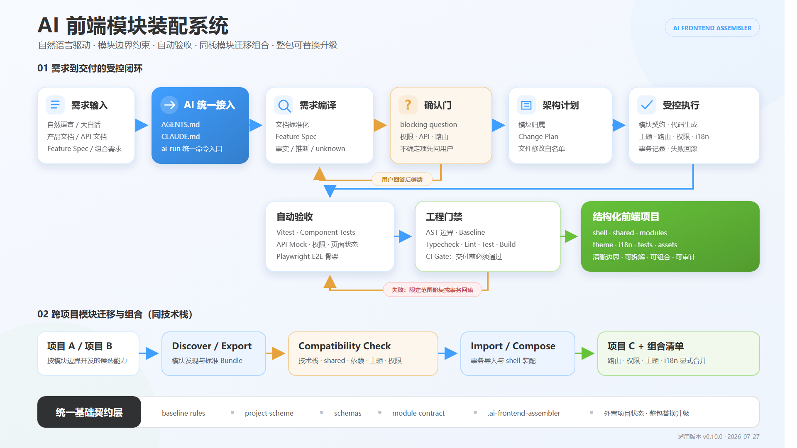

# AI 前端模块装配系统使用指南

> 适用产品：AI 前端模块装配系统  
> 机器目录：`ai-baseline-kit/`  
> 适用版本：`0.10.0+`  
> 文档日期：2026-07-27  
> 适用对象：产品经理、前端开发、测试人员、项目负责人、AI 使用者、研发效能和资产管理人员

## 1. 这套系统是什么

AI 前端模块装配系统是一套放在前端项目根目录中的 AI 工程能力包。使用者可以用自然语言、产品文档或已经整理好的 Feature Spec 描述需求，AI 按固定闭环完成：

```text
理解需求 → 识别不确定项 → 向用户确认 → 拆分模块和文件范围
→ 受控写代码 → 生成验收测试 → 检查模块边界 → 验证构建
→ 自动修复或回滚 → 输出交付结果
```

系统的重点不是替代某一个大模型，而是给不同 AI 提供同一套项目地图、工程规则、执行入口和验证门禁，使最终写入仓库的代码尽量保持一致、清晰、可拆解、可组合、可审计。



## 2. 使用者只需要做三件事

1. **首次接入时完整复制 `ai-baseline-kit/` 文件夹，不要拆散内部文件。**
2. **直接用自然语言说明要做什么；不需要背 Skill 名称、脚本命令或内部流程。**
3. **只在 AI 提出真正阻塞实施的问题时补充信息，其他分析、计划、检查和修复由系统自动完成。**

### 默认安全入口 Prompt（首次接入或入口不确定时）

如果项目根目录还没有 `AGENTS.md` / `CLAUDE.md`，或者已有文件没有提到本装配系统，直接把下面这句话发给 AI：

```text
请接入并使用项目根目录 ai-baseline-kit 的 AI 前端模块装配系统处理本次需求：<需求或产品文档路径>
```

AI 必须自动完成以下动作，使用者不需要再补充脚本命令：

1. 检查根 `AGENTS.md`、`CLAUDE.md`；缺失就创建，存在但未接入就保留原文并追加入口，重复执行不得重复追加。
2. 读取 `ai-baseline-kit/AGENTS.md`，识别旧项目增量模式或新项目创建模式。
3. 将需求或产品文档转换为 Feature Spec；存在无法可靠推断的 blocking question 时一次性提问。
4. 确认后生成 Change Plan，只在白名单内实现代码、i18n、主题、装配和验收测试。
5. 执行最终 delivery Gate，生成当前请求的交付回执；没有有效回执不得宣布“已完成”。

入口接入成功后，日常只需要说：

```text
帮我实现：<需求>
按这个产品文档开发：<文档路径>
检查并修复当前项目
```

接入完成后，日常可以直接说：

```text
帮我实现：新增客户列表页，支持名称和状态筛选。
```

也可以直接给文档或组合需求：

```text
按这个产品文档开发：docs/product/customer-management.md

把项目 A 的客户模块和项目 B 的授权模块组合成项目 C。

检查并修复当前项目。
```

AI 必须从根目录入口自动读取装配系统规则，并在内部完成需求规格、变更计划、白名单实施、测试、边界检查、验证和必要修复。使用者不需要在提示词中重复 `Feature Spec`、`Change Plan`、`AST`、`validate`、`gate` 或具体脚本名。

## 3. 使用前准备

### 3.1 电脑环境

至少需要：

- Git；
- Node.js，建议使用当前公司统一的 LTS 版本；
- 项目自身所需的包管理器，例如 npm、pnpm 或 yarn；
- 能读取项目文件、修改文件和执行终端命令的 AI 编程工具。

普通网页聊天模型只能提供文本建议，不能执行本系统的脚本和门禁，因此不属于完整接管模式。

### 3.2 项目目录

接入后的项目根目录至少应看到：

```text
project-root/
├── AGENTS.md
├── CLAUDE.md
├── ai-baseline-kit/
├── .ai-frontend-assembler/
└── 原有业务代码...
```

说明：

- `ai-baseline-kit/`：可整体替换升级的能力包；
- `.ai-frontend-assembler/`：当前业务项目自己的地图和状态，必须保留并提交 Git；
- `AGENTS.md`：支持 AGENTS 入口的 AI 使用；
- `CLAUDE.md`：Claude 类 AI 使用；
- 当前只维护这两个 AI 入口，不生成 Cursor、Copilot 等专属入口文件。

## 4. 第一次接入项目

### 4.1 复制能力包

将完整目录复制到目标项目根目录：

```text
<目标项目>/ai-baseline-kit/
```

不要只复制 `skills/`，也不要把 `docs/`、`scripts/` 拆到项目根目录。

### 4.2 让 AI 自动接入

在目标项目根目录打开支持读写文件和执行终端命令的 AI 编程工具，然后只需要说：

```text
请接入并使用项目根目录 ai-baseline-kit 的 AI 前端模块装配系统处理本次需求：接入并检查当前项目。
```

AI 应自动执行初始化、项目识别、入口补齐、诊断和首次门禁；使用者不需要手动输入命令。完成后，AI 应用中文汇总：

- 识别到的技术栈；
- shell、shared、modules 或项目等价目录；
- 路由、状态、API、i18n 和主题入口；
- 是否存在必须确认的 unknown 字段；
- 首次验证是否通过。

初始化会：

- 识别这是旧项目还是新项目；
- 识别框架、构建工具、路由、状态、i18n、API client 和模块目录；
- 创建或补充根目录 `AGENTS.md`、`CLAUDE.md`；
- 在 `.ai-frontend-assembler/` 中生成项目地图和状态；
- 旧项目首次接入时记录历史基线，后续只阻止新增违规。

> 高级或排障场景才需要手动执行 `node ai-baseline-kit/scripts/ai-run.mjs init`、`doctor` 和 `gate`。日常使用不要求记忆这些命令。

## 5. 最常用的开发方式

### 5.1 直接描述需求

```text
帮我实现：在客户管理模块增加客户列表页，支持按名称和状态筛选，查看详情需要 customer:read 权限。
```

### 5.2 直接提供产品文档

```text
按这个产品文档开发：docs/product/customer-management.md
```

文档可以是 AI 能读取或提取的文本、Markdown、JSON、API 文档等。对于 PDF、Word、图片或原型，AI 必须先确认已经成功提取内容；无法读取时应明确说明，不能假装已经阅读。

### 5.3 只要方案，暂不改代码

```text
先分析这个需求并给出实施方案，暂时不要改代码：<需求或文档路径>
```

### 5.4 新建项目

```text
创建一个设备授权管理前端项目，包含授权列表、详情和续期操作，项目放到 D:/workspace/licensing-console。
```

未指定技术栈时默认使用 React 18 + TypeScript + Vite + Ant Design 5 + Tailwind CSS 3。明确说“使用 Vue 3”时使用 Vue 3 + TypeScript + Vite + Element Plus。Vue 标准模板默认保留 Element Plus 原生配色；React 标准模板默认保留 Ant Design 原生配色；两个模板都通过 `src/theme/theme.css` 提供全局可修改主题入口。

### 5.5 高级命令不是日常入口

`ai-run.mjs develop`、`smart-develop.mjs` 等命令保留给 AI、CI 和排障人员调用。普通使用者只描述目标，不负责选择脚本或组织内部参数。

## 6. AI 向用户提问时怎么回答

出现以下情况时，系统应停止生成业务代码并提问：

- 不知道功能属于哪个模块；
- 路由地址或稳定英文标识不明确；
- 权限码、角色或无权限表现不明确；
- API 方法、路径、关键请求响应字段不明确；
- 删除、审批、支付、发布等高风险操作缺少确认规则；
- loading、empty、error、ready、permission-denied 等页面状态不明确；
- 需求与项目技术栈或现有规则冲突。

推荐回答方式：

```text
1. 模块：licensing
2. 路由：/licensing/summary
3. 权限码：licensing:read
4. 无权限行为：展示 403 页面，不隐藏菜单
5. API：GET /api/licensing/summary
6. 空数据：展示空状态，不跳转
```

不知道的内容可以直接回答“暂不确定”，让 AI 保持 blocking 状态，不能要求它自行猜测接口和权限。

## 7. 完成开发后的标准动作

普通使用者只需要说：

```text
检查并修复当前项目。
```

AI 必须自动执行验证、最终门禁和有限次数修复；失败时只处理报告与本次白名单内的问题，不能顺带重构。

以下命令用于 AI、CI 或人工排障。

### 7.1 项目验证

```bash
node ai-baseline-kit/scripts/ai-run.mjs validate
```

验证会根据项目实际声明执行：

- 基线检查；
- AST 模块边界检查；
- TypeScript 类型检查；
- lint；
- Vitest 或项目单元测试；
- production build；
- 验收条件覆盖检查。

### 7.2 最终门禁

```bash
node ai-baseline-kit/scripts/ai-run.mjs gate
```

只有 Gate 通过，才能认为本次工程交付完成。页面能打开不等于通过。

### 7.3 自动修复

```bash
node ai-baseline-kit/scripts/ai-run.mjs repair --request "修复本次开发验证失败的问题"
```

修复必须限定在本次 Change Plan 和失败报告范围内。不得通过删除测试、关闭规则、刷新旧项目快照等方式伪造通过。

## 8. 旧项目使用说明

旧项目接入不会强制迁移到 React、Vue 或标准模板，也不会要求一次性清理所有历史问题。

旧项目首次初始化后：

```text
.ai-frontend-assembler/
├── project-scheme.yml
├── legacy-baseline.json
└── state.json
```

规则：

- `legacy-baseline.json` 记录接入前的历史违规；
- 日常修改只阻止新增违规；
- 新增模块仍必须满足完整模块契约；
- 不能为了让检查通过而刷新历史快照；
- 旧状态系统、旧路由或旧 API 模式可以保留，但新增代码应按项目地图中的增量策略接入。

## 9. 从项目 A、B 组合项目 C

适用前提：A、B 使用兼容技术栈，并且候选功能已按模块边界开发。

### 9.1 推荐的自然语言方式

对 AI 说：

> 从项目 A 中抽离客户模块，从项目 B 中抽离授权模块，组合成 Vue 3 + Element Plus 项目 C。先检查模块边界、依赖、shared 契约、主题、权限、路由和 i18n；有冲突先问我；确认后执行组合，失败自动回滚并输出组合清单。

AI 使用：

```bash
node ai-baseline-kit/scripts/ai-run.mjs compose --request "需求文档或自然语言" --workspace-root "D:/workspace"
```

### 9.2 维护人员的分步命令

```bash
node ai-baseline-kit/scripts/module-export.mjs --project-root <project-a> --module <module-a> --output <bundle-a>
node ai-baseline-kit/scripts/module-export.mjs --project-root <project-b> --module <module-b> --output <bundle-b>
node ai-baseline-kit/scripts/module-compatibility-check.mjs --project-root <project-c> --bundle <bundle-a>
node ai-baseline-kit/scripts/module-compatibility-check.mjs --project-root <project-c> --bundle <bundle-b>
node ai-baseline-kit/scripts/project-compose.mjs --project-root <project-c> --stack vue3-vite-ts --bundles <bundle-a>,<bundle-b>
```

禁止直接复制模块目录并手工覆盖同名文件，因为这会绕过 shared、路由、权限、主题、依赖和 i18n 契约。

## 10. 国际化使用说明

默认沿用项目已有 i18n 方案。语言资源推荐使用扁平 key：

```json
{
  "licensing.summary.title": "一体机授权",
  "licensing.summary.empty": "暂无授权数据"
}
```

页面中使用稳定 key，不使用中文和 key 双向映射：

```ts
t('licensing.summary.title')
```

原因：

- key 稳定，可重构中文文案；
- 不会出现中文重复导致映射冲突；
- 便于模块迁移、自动检查和多语言覆盖统计；
- 模块资源更容易独立导出和合并。

## 11. 主题和 UI 一致性

- React 新项目默认 Ant Design 5 原生配色；
- Vue 3 新项目默认 Element Plus 原生配色；
- 不要求业务页面自行定义一套品牌色；
- 全局修改统一进入 `src/theme/theme.css` 或项目地图声明的主题入口；
- 模块私有样式留在模块内部；
- 禁止在多个页面重复写全局主题变量。

## 12. 升级方式

适用于已经接入 `0.10.0` 或以上版本的项目：

1. 保留项目根目录 `.ai-frontend-assembler/`；
2. 删除旧的整个 `ai-baseline-kit/`；
3. 复制新的整个 `ai-baseline-kit/`；
4. 执行：

```bash
node ai-baseline-kit/scripts/ai-run.mjs upgrade
node ai-baseline-kit/scripts/ai-run.mjs doctor
node ai-baseline-kit/scripts/ai-run.mjs gate
```

不要使用操作系统的“合并文件夹并覆盖部分文件”，否则旧版本已经废弃的文件可能残留。

从 `0.9.x` 或更早版本首次升级时，必须在旧包内项目状态仍然存在时先完成迁移；如果先删除唯一旧项目地图且没有 Git 备份，系统无法凭空恢复。

## 13. 提交 Git 前检查清单

让 AI 或开发者逐项确认：

- [ ] 本次需求的 Feature Spec 已 ready；
- [ ] 所有 blocking question 已确认；
- [ ] 修改文件都在 Change Plan 范围内；
- [ ] 新模块拥有 `module.meta.json`、`manifest.ts` 和公开入口；
- [ ] 模块之间没有直接引用；
- [ ] 路由、菜单、权限和依赖装配集中且显式；
- [ ] i18n、主题和资源归属正确；
- [ ] acceptance 已映射到测试文件；
- [ ] `validate` 通过；
- [ ] `gate` 通过；
- [ ] 当前请求的 delivery receipt 存在、`status=passed`、`checks.finalGate=passed` 且 `changedFilesHash` 可复核；
- [ ] `.ai-frontend-assembler/` 已提交；
- [ ] 未将 `ai-baseline-kit/` 加入 `.gitignore`。

## 14. 公司推荐角色分工

| 角色 | 主要职责 |
| --- | --- |
| 需求提出人 | 提供需求或产品文档，回答 blocking question，确认验收条件 |
| AI 操作者 | 使用统一入口，不绕过计划和门禁，保留运行记录 |
| 模块负责人 | 确认模块归属、公开契约、依赖和可迁移性 |
| 测试/产品 | 验收业务行为、边缘状态和权限行为 |
| 项目负责人 | 强制 CI Gate、审核高风险变更和跨模块共享能力 |
| 能力包维护者 | 维护 `ai-baseline-kit/`、版本、契约测试和升级兼容性 |
| 资产管理员 | 登记版本、仓库、权属、发布记录、使用范围和责任人 |

## 15. 禁止事项

- 不读取 `AGENTS.md` / `CLAUDE.md` 就直接开发；
- Feature Spec 未 ready 就生成业务代码；
- 为了省事把业务能力全部放进 shared；
- 模块直接导入另一个模块的私有文件；
- 手工复制模块绕过兼容性检查；
- 删除测试、关闭 AST 检查或跳过 Gate 来伪造成功；
- 自动刷新 `legacy-baseline.json` 掩盖本次新增问题；
- 把项目专属状态写回可替换的 `ai-baseline-kit/`；
- 只覆盖部分新包文件而保留废弃旧文件；
- 把 `ai-baseline-kit/` 加入 `.gitignore`。

## 16. 常见问题

### Q1：普通使用者需要理解所有脚本吗？

不需要。日常不需要记忆任何脚本；直接说“接入装配系统”“帮我实现”“检查并修复”或“升级装配系统”即可。命令只用于 AI、CI 和排障。

### Q2：AI 问很多问题怎么办？

只回答 blocking question。系统要求一次性收敛最关键问题，不应该反复询问与实现无关的偏好。

### Q3：能不能直接让 AI 改代码？

可以，但必须先完成需求确认和结构计划，并在完成后执行验证门禁。不能只靠提示词要求 AI 自觉遵守。

### Q4：检查通过就代表业务一定正确吗？

不代表。Gate 主要保证工程结构、声明的验收、类型、测试和构建。产品语义仍需需求方和测试人员验收。

### Q5：其他 AI 能使用吗？

只要 AI 能读取项目文件、执行 Node 脚本并遵循 `AGENTS.md` 或 `CLAUDE.md`，就可以使用。普通聊天模型无法完成完整闭环。

### Q6：Skill 能否单独抽离？

逻辑上可以，但并非所有 Skill 当前都能只复制一个 `SKILL.md` 就完整运行。详见 [`skill-standalone-guide.md`](skill-standalone-guide.md)。

## 17. 一句话使用

系统接入完成后，不推荐复制固定长提示词。用户只说目标，AI 自动展开完整闭环。

### 开发

```text
帮我实现：<需求>
```

### 产品文档

```text
按这个产品文档开发：<路径>
```

### 项目组合

```text
把项目 A 的 <模块> 和项目 B 的 <模块> 组合成项目 C。
```

如果项目名称不足以定位，直接提供路径即可：

```text
把 D:/workspace/project-a 的客户模块和 D:/workspace/project-b 的授权模块组合到 D:/workspace/project-c。
```

### 检查修复

```text
检查并修复当前项目。
```

### 升级

```text
升级装配系统并验证项目。
```

### 兼容模式

只有当使用的 AI 工具不会自动读取根目录 `AGENTS.md` 或 `CLAUDE.md` 时，才补充一句：

```text
先读取项目根目录 AGENTS.md 或 CLAUDE.md，再处理：<需求>
```

这句话只是激活入口，不需要继续描述 Feature Spec、Change Plan、模块 CLI、AST、validate 或 gate。若 AI 工具既不能读取项目文件，也不能执行终端命令，则只能获得建议，不能完成本系统的受控闭环。
